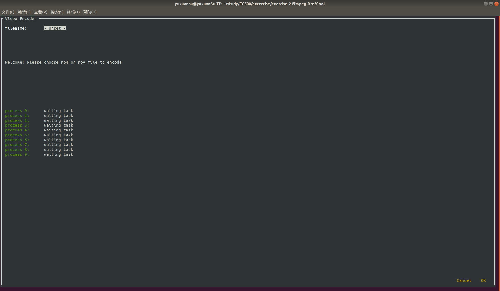
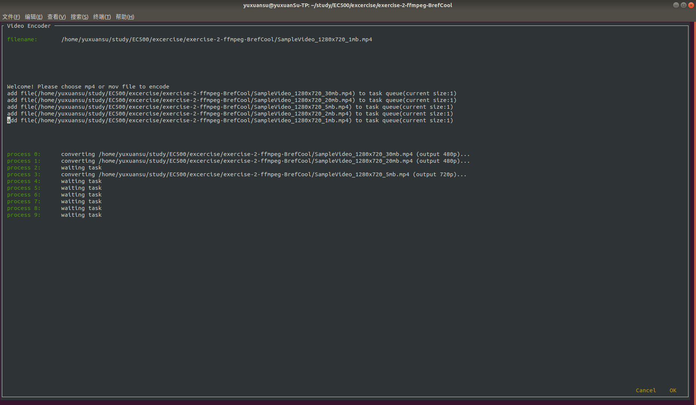

# EC500 exerciese 2: Video Encoder

A python program encodes multiple videos simultaneously.  

## Prerequisite  
`ffmpeg` is needed for this program.  
python version: 3.5+  
use `pip` to install all the required packages in `requirements.txt`:  
`
pip install -r requirements.txt
`

## Estimate the processing power(Task 1 in Exercise 2)  
When encoding the video, single instance of `ffmpeg` may cost nearly 100% of all CPUs.  
   

## How to use Video Encoder? (Task 2 in Exercise 2)
to launch the encoder, you only need:  
`
python main.py
`  
this will open the Video Encoder Interface in terminal:  
  
Here, we can see that this program open 10 processes in default. All the processes are waiting for the files to encode.  
Move to the "filename" textfield and press it, we can choose a mp4 or mov file to encode:  
  
Press "OK", this file will add to the task queue and one of the process will take it and start processing it:  
  
  
You can add more files. Then processes can encode all the file you added simultaneously.  
  
When some of the process finish their jobs. They will start waiting new task:  
  
At last, press "cancel" to leave the program. It will terminate all the processes:  
  
